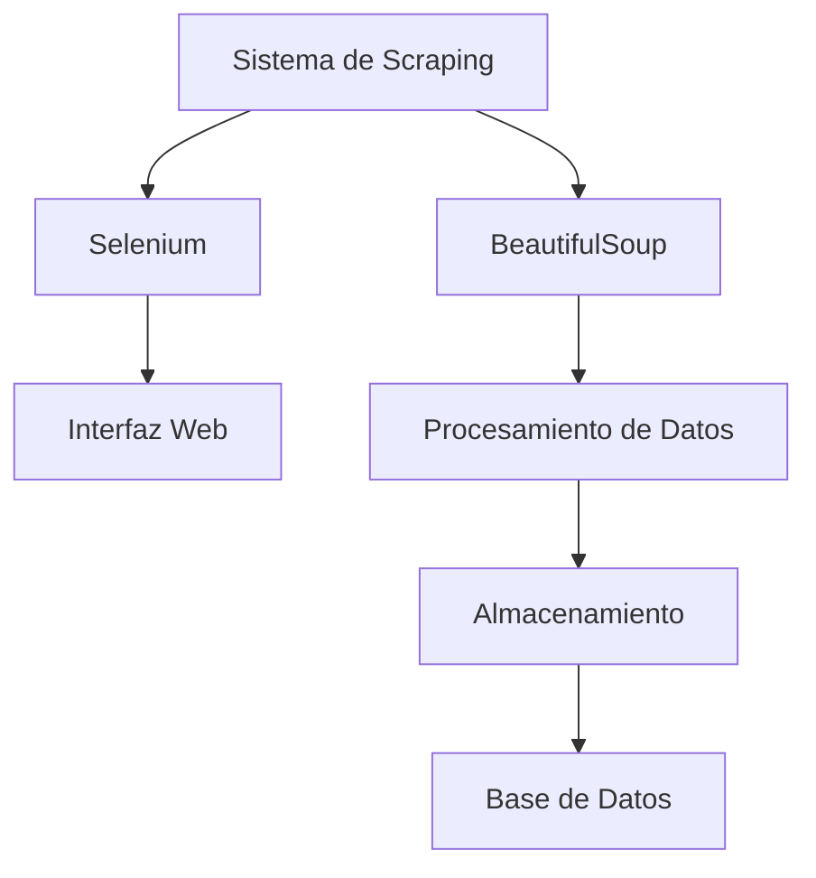

# Diagrama de Arquitectura del Proyecto Walmart Scraper

```mermaid
graph TD
    A[Sistema de Scraping] --> B[Selenium]
    A --> C[BeautifulSoup]
    B --> D[Interfaz Web]
    C --> E[Procesamiento de Datos]
    E --> F[Almacenamiento]
    F --> G[Base de Datos]
```